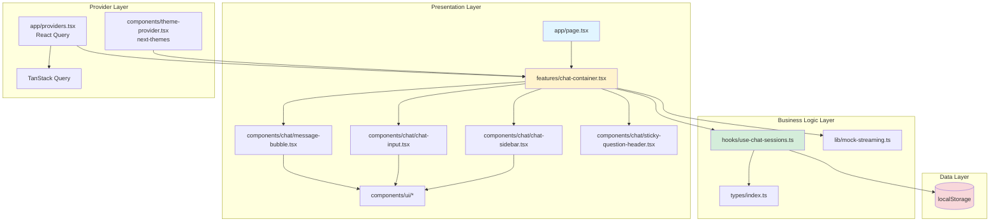
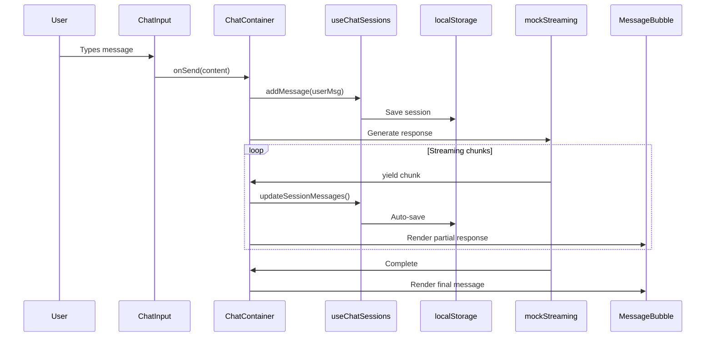

# AI Chat App

A modern, production-ready AI chat application inspired by Claude and Perplexity AI. Built with clean architecture principles using Next.js 14+, TypeScript, and shadcn/ui.

---

## 🏗️ Architecture Overview

This application follows a **feature-based clean architecture** with clear separation of concerns:



### 🔄 Data Flow



---

## 📂 Clean Architecture Layers

### 1. **Presentation Layer** (`app/`, `features/`, `components/`)

- **Responsibility**: UI rendering, user interactions, and component composition
- **Key Files**:
  - `app/page.tsx` - Entry point, orchestrates providers and command menu
  - `features/chat/chat-container.tsx` - Feature module, manages chat state and orchestrates child components
  - `components/chat/*` - Specialized chat UI components
  - `components/ui/*` - Reusable shadcn/ui primitives

### 2. **Business Logic Layer** (`hooks/`, `lib/`)

- **Responsibility**: State management, data transformations, and business rules
- **Key Files**:
  - `hooks/use-chat-sessions.ts` - Session CRUD operations, localStorage persistence
  - `lib/mock-streaming.ts` - Async generator for streaming simulation
  - `lib/utils.ts` - Utility functions (classname merging, date formatting)

### 3. **Data Layer** (`types/`, localStorage)

- **Responsibility**: Type definitions and data persistence
- **Key Files**:
  - `types/index.ts` - TypeScript interfaces (Message, ChatSession, Artifact, StreamingChunk)
  - localStorage - Client-side persistent storage for chat history

### 4. **Provider Layer** (`app/providers.tsx`, `components/theme-provider.tsx`)

- **Responsibility**: Global state providers and context
- **Providers**:
  - `QueryClientProvider` - React Query for async state management
  - `ThemeProvider` - next-themes for light/dark mode

---

## 🧩 Component Hierarchy

```
app/layout.tsx (Root Layout)
└── ThemeProvider
    └── Providers (React Query)
        └── app/page.tsx
            ├── CommandMenu (⌘K menu)
            └── features/chat-container.tsx
                ├── ChatSidebar
                │   └── Session list with actions
                ├── Content Area
                │   ├── StickyQuestionHeader (conditional)
                │   ├── MessageBubble[] (messages)
                │   │   ├── User messages (right-aligned)
                │   │   └── Assistant messages (markdown + artifacts)
                │   └── ThinkingIndicator (streaming)
                └── ChatInput
```

---

## 🔑 Key Design Patterns

### 1. **Custom Hooks for State Management**

- `useChatSessions`: Encapsulates all session logic (CRUD + persistence)
- Keeps components pure and testable
- Single source of truth for chat state

### 2. **Async Generators for Streaming**

```typescript
async function* mockStreamResponse(text: string, delayMs: number) {
	for (let i = 0; i <= text.length; i++) {
		yield { content: text.slice(0, i), done: i === text.length };
		await new Promise((resolve) => setTimeout(resolve, delayMs));
	}
}
```

### 3. **Component Composition**

- Small, focused components with single responsibilities
- Props-based communication (no prop drilling via context where needed)
- Reusable UI primitives from shadcn/ui

### 4. **Optimistic UI Updates**

- Messages appear instantly in the UI
- Streaming updates render in real-time
- localStorage saves happen in the background

---

## 🎯 Core Features

### ✅ Implemented

- **Streaming Responses**: Token-by-token rendering with realistic delays
- **Claude-style Artifacts**: Expandable code blocks with syntax highlighting
- **Sticky Question Header**: Perplexity-style pinned question during scroll
- **Local Persistence**: Auto-save to localStorage with session management
- **Command Menu**: ⌘K/Ctrl+K for quick actions
- **Theme Toggle**: Light/Dark mode with system preference support
- **Responsive Design**: Mobile-first approach with Tailwind CSS

### 🚧 Planned

- Server-side search with caching (React Query)
- Mentions (@) autocomplete
- Message editing functionality
- Export chat to markdown/JSON

---

## 🚀 Getting Started

### Prerequisites

- Node.js 18+ or Bun
- Package manager: npm, pnpm, or yarn

### Installation

```bash
# Clone and install
npm install

# Start development server
npm run dev
```

Open [http://localhost:3000](http://localhost:3000)

### Build for Production

```bash
npm run build
npm start
```

---

## 🛠️ Tech Stack

| Layer                | Technology                      |
| -------------------- | ------------------------------- |
| **Framework**        | Next.js 14 (App Router)         |
| **Language**         | TypeScript 5+                   |
| **Styling**          | Tailwind CSS 3 + CSS Variables  |
| **UI Components**    | shadcn/ui (Radix UI primitives) |
| **State Management** | React Query (TanStack)          |
| **Theming**          | next-themes                     |
| **Markdown**         | react-markdown + remark-gfm     |
| **Icons**            | lucide-react                    |

---

## 📁 Project Structure

```
├── app/                          # Next.js App Router
│   ├── layout.tsx               # Root layout with providers
│   ├── page.tsx                 # Main chat page
│   ├── providers.tsx            # React Query provider
│   ├── globals.css              # Tailwind + CSS variables (light/dark)
│   └── api/                     # API routes (future)
│       ├── mentions/route.ts
│       └── search/route.ts
│
├── features/                     # Feature modules
│   └── chat/
│       └── chat-container.tsx   # Chat orchestrator (main logic)
│
├── components/
│   ├── chat/                    # Chat-specific components
│   │   ├── chat-input.tsx       # Message input with auto-resize
│   │   ├── chat-sidebar.tsx     # Session list sidebar
│   │   ├── message-bubble.tsx   # Message renderer (markdown/artifacts)
│   │   ├── sticky-question-header.tsx  # Scroll-based sticky header
│   │   └── thinking-indicator.tsx      # Loading animation
│   ├── ui/                      # shadcn/ui primitives
│   │   ├── button.tsx
│   │   ├── card.tsx
│   │   ├── input.tsx
│   │   └── ... (15+ components)
│   ├── command-menu.tsx         # ⌘K command palette
│   └── theme-provider.tsx       # next-themes wrapper
│
├── hooks/
│   ├── use-chat-sessions.ts     # Session state + localStorage
│   └── use-search.ts            # Search hook (future)
│
├── lib/
│   ├── mock-streaming.ts        # Async generator for streaming
│   └── utils.ts                 # cn(), formatDate()
│
└── types/
    └── index.ts                 # Global TypeScript interfaces
```

---

## 🎨 Theming

The app uses **CSS variables** for theming, enabling seamless light/dark mode switching:

```css
/* Light mode (default) */
:root {
	--background: 0 0% 100%;
	--foreground: 0 0% 0%;
	--primary: 0 0% 0%;
	/* ...other tokens */
}

/* Dark mode */
.dark {
	--background: 222.2 47.4% 11.2%;
	--foreground: 210 40% 98%;
	--primary: 210 40% 98%;
	/* ...other tokens */
}
```

**How to customize:**

1. Edit `app/globals.css` to modify color tokens
2. Use Tailwind classes like `bg-background`, `text-foreground`
3. Theme toggle is available via `<ThemeToggle />` component

---

## 🧪 Testing Locally

```bash
# Type check
npm run build

# Lint
npm run lint

# Start dev server
npm run dev
```

**Test scenarios:**

- Create new chat session
- Send messages and verify streaming
- Switch between sessions in sidebar
- Scroll long responses to see sticky header
- Toggle light/dark theme
- Use ⌘K menu (New Chat, Clear History)

---

## 📝 License

MIT
